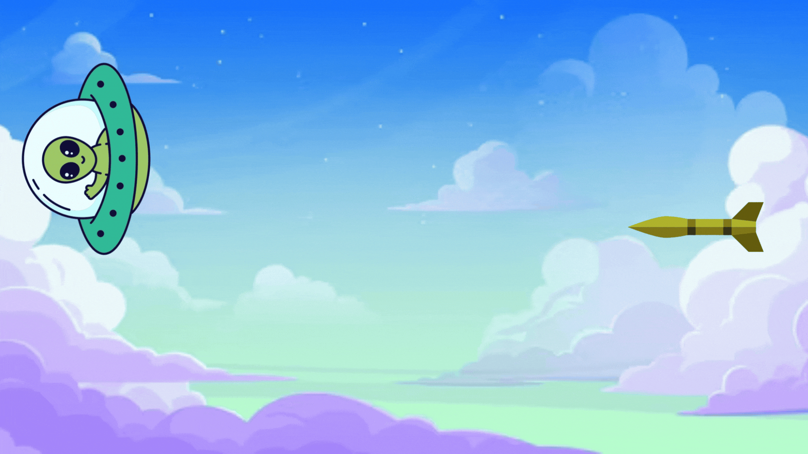

# Pong 51 🎯
### by Danilo de Castro e Guilherme Holanda

## Relatório - Reinventando Pong

## 1. Introdução

Este projeto faz parte da proposta de reinvenção do clássico jogo *Pong*, trazendo uma nova abordagem e mecânica baseada em elementos de ação e precisão. A ideia principal foi transformar a dinâmica tradicional do jogo em um duelo entre um OVNI e um míssil, onde cada jogador pode assumir um desses papéis e tentar alcançar seu objetivo dentro das novas regras estabelecidas.

## 2. Pesquisa e Análise Inicial

O jogo *Pong* original é um dos primeiros jogos eletrônicos da história, baseado em uma mecânica simples de rebater uma bola entre duas barras controláveis. Analisando *Pong* sob o Framework **MDA** (Mechanics, Dynamics, Aesthetics):

- **Mecânica (Mechanics):** O jogo se baseia no movimento horizontal de barras que tentam rebater uma bola para o lado do oponente.
- **Dinâmica (Dynamics):** O desafio consiste em prever a trajetória da bola e reagir rapidamente para impedir que ela passe.
- **Estética (Aesthetics):** O jogo promove competição e engajamento ao criar uma disputa simples, mas desafiadora.

O que torna *Pong* envolvente é sua jogabilidade intuitiva, o ritmo acelerado e a necessidade de reflexos rápidos. Seus elementos principais de diversão e desafio são o tempo de reação, a estratégia para posicionamento das barras e o aumento da dificuldade conforme o jogo avança.

## 3. Proposta de Reinvenção

A reinvenção de *Pong* proposta neste projeto altera a dinâmica do jogo, substituindo a bola por um míssil e as barras por um OVNI em movimento. Essa mudança cria um novo tipo de desafio baseado em precisão de disparo e esquiva.

### **Tema e Ambientação**
O jogo se passa em um cenário futurista, onde um míssil é lançado contra um OVNI que tenta escapar. A ambientação remete a um céu alienígena, reforçando o conceito de uma perseguição aérea.

### **Personagens ou Elementos Visuais**
Os dois principais elementos do jogo são:
- **O Míssil:** Um projétil que é disparado e precisa acertar seu alvo.
- **O OVNI:** Um disco voador que se move automaticamente para cima e para baixo.

O fundo do jogo apresenta um céu estilizado com nuvens e estrelas, reforçando a estética de um ambiente espacial.

### **Mudanças na Mecânica**
Diferente do *Pong* original, onde o movimento é contínuo e controlado, o jogo agora se baseia nas seguintes regras:
- Se o jogador escolher ser o **Míssil**, ele deve selecionar o momento certo para disparar e tentar acertar o OVNI, que se move automaticamente para cima e para baixo.
- Se o jogador escolher ser o **OVNI**, ele controla sua movimentação no eixo Y, tentando escapar do míssil disparado automaticamente.

Essa mecânica altera o foco do jogo, trazendo um elemento de estratégia e precisão ao invés de apenas rebatidas.

### **Objetivo da Reinvenção**
O objetivo desta nova versão é explorar o conceito de **tempo de reação e precisão**, adicionando uma camada de estratégia ao jogo. Enquanto *Pong* exige controle contínuo, *UFO vs Missile* desafia o jogador a tomar decisões rápidas e precisas.

#### **Folha de Concept Art**
(O conceito do jogo pode ser ilustrado com um rascunho da ideia principal, destacando os elementos visuais e mecânicos.)

## 4. Tela Digital do Jogo

### **Imagem do Protótipo**

### **Adaptação do Concept para o Digital**
A adaptação do conceito para o formato digital envolveu a implementação dos seguintes elementos:
- **Movimentação automatizada do OVNI** para criar um desafio imprevisível.
- **Disparo manual do míssil** para garantir que o jogador tenha controle sobre sua tentativa de acerto.
- **Uso de cores e formas simples**, garantindo uma interface clara e objetiva.
- **Animações suaves**, para manter o dinamismo do jogo e tornar os movimentos mais intuitivos.

O layout foi pensado para tornar a experiência imersiva, mantendo uma estética limpa e funcional.

## 5. Reflexão e Aprendizados

Cada membro da equipe reflete sobre os desafios e aprendizados adquiridos no projeto.

- **Maiores desafios enfrentados:**
  - Implementação da movimentação automatizada do OVNI de forma equilibrada.
  - Ajuste da precisão do míssil para garantir que o jogo seja justo e desafiador.
  - Design da interface e escolha de elementos visuais coerentes com a temática.

- **Habilidades desenvolvidas ou aprimoradas:**
  - Desenvolvimento e ajustes de mecânicas de jogo.
  - Trabalho com sprites e movimentação de objetos.
  - Planejamento e organização de um projeto baseado em um conceito pré-existente.

## 6. Referências

Caso tenham sido utilizadas referências externas para a criação do jogo, listá-las aqui.

---

© [Ano] - Desenvolvido por [Nome da Equipe / Integrantes]

